# Screenshots

This directory contains screenshots showcasing the SPSB (Student Admission System) user interface and major workflows.

---

## Dashboard

Overview of the administrative dashboard and analytics.

| Screenshot                  |
| --------------------------- |
| 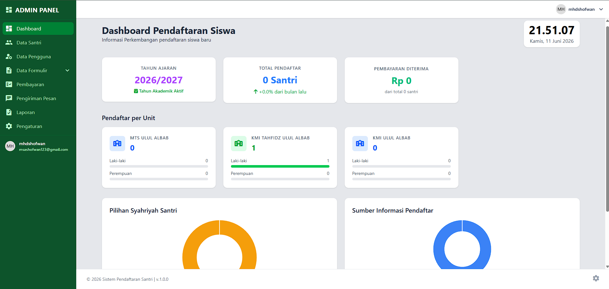 |

---

## Registration Workflow

Multi-step registration experience for prospective students.

<table>
<tr>
<td align="center">
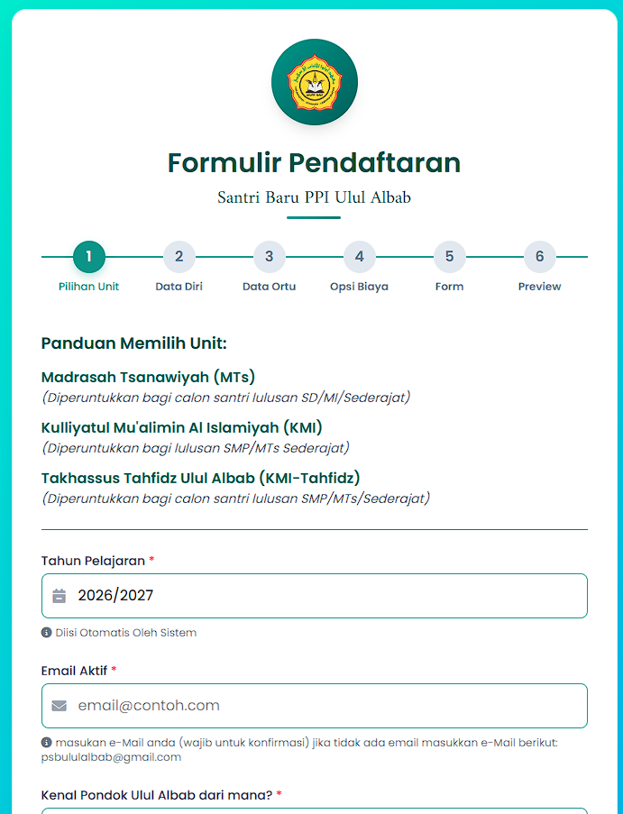 
<b>Step 1</b>
</td>
<td align="center">
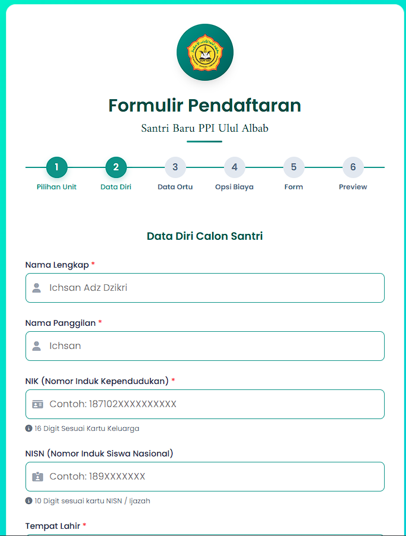 
<b>Step 2</b>
</td>
<td align="center">
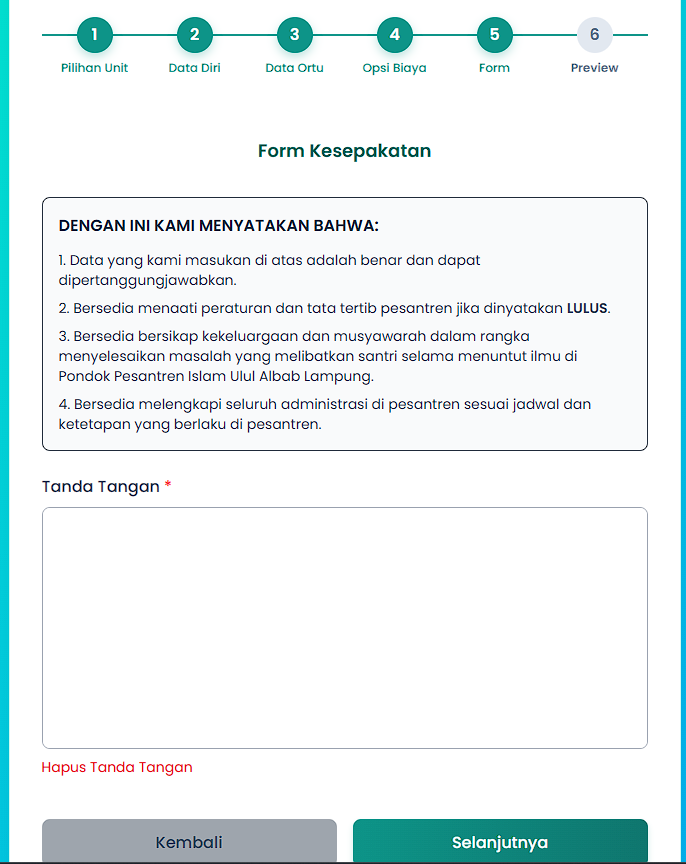 
<b>Step 3</b>
</td>
</tr>
</table>

---

## Payment Information

Payment instructions provided to applicants after registration.

| Screenshot               |
| ------------------------ |
| 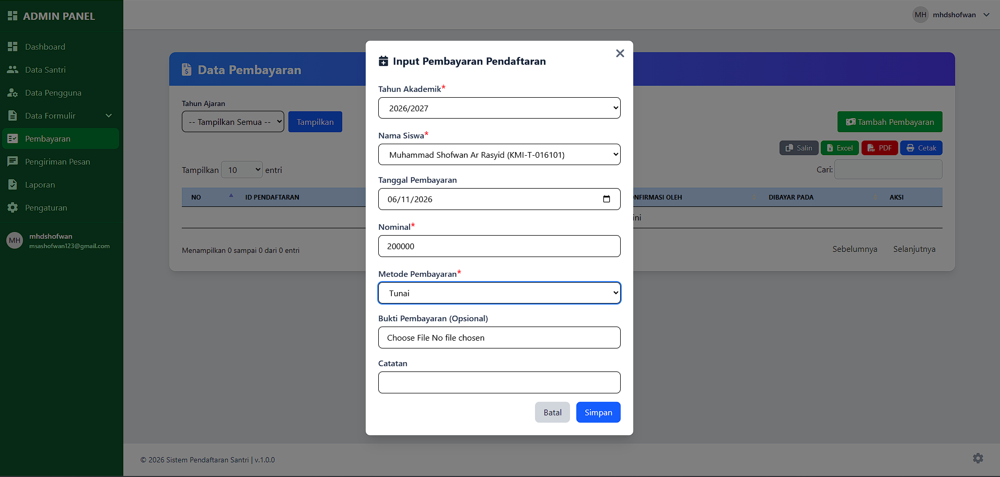 |

---

## Student Management

Administrative tools for managing student records.

| Screenshot                |
| ------------------------- |
| 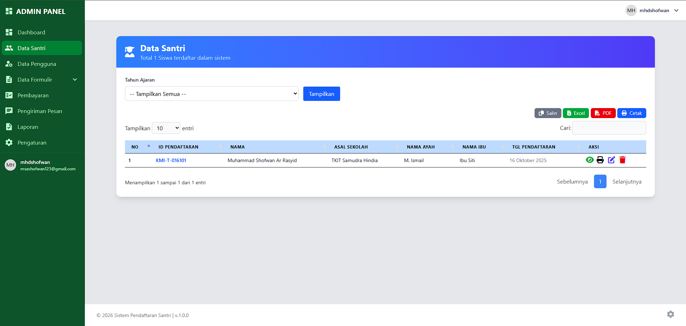 |

---

## User Management

Management interface for administrators and users.

| Screenshot          |
| ------------------- |
| 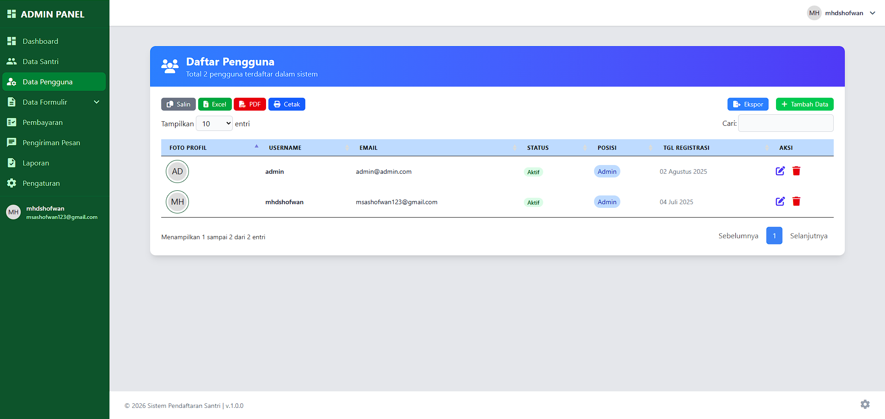 |

---

## Student Profile

Public-facing student information and registration details.

| Screenshot           |
| -------------------- |
| 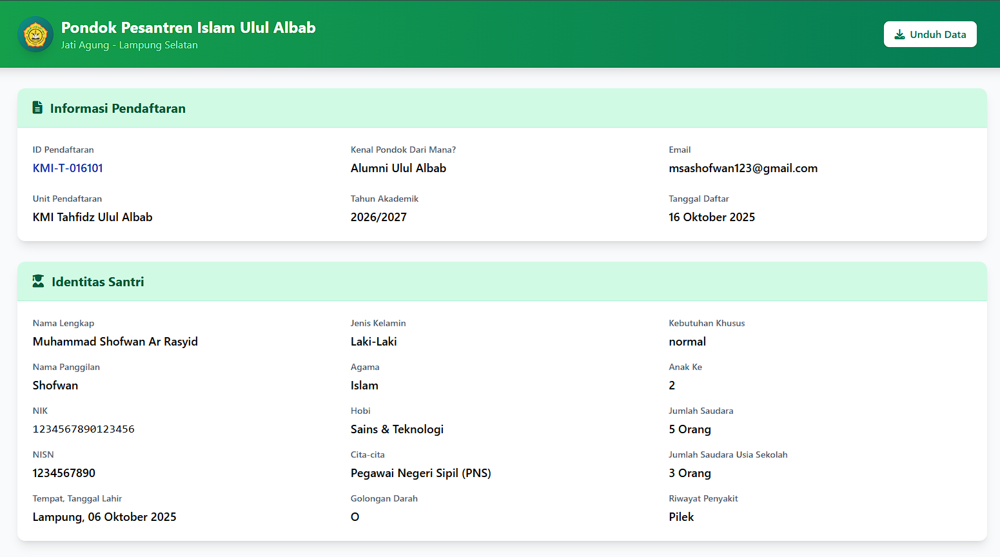 |

---

## Reports

Reporting and export functionality.

| Screenshot              |
| ----------------------- |
| 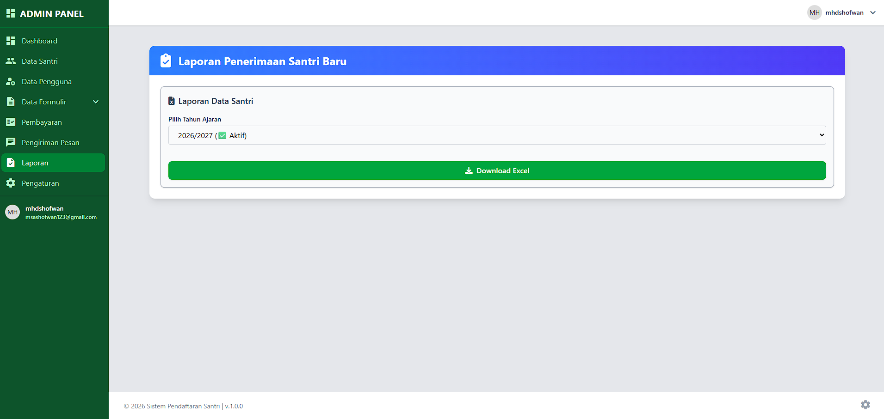 |

---

## Printable Documents

Generated printable biodata and PDF documents.

| Screenshot      |
| --------------- |
| 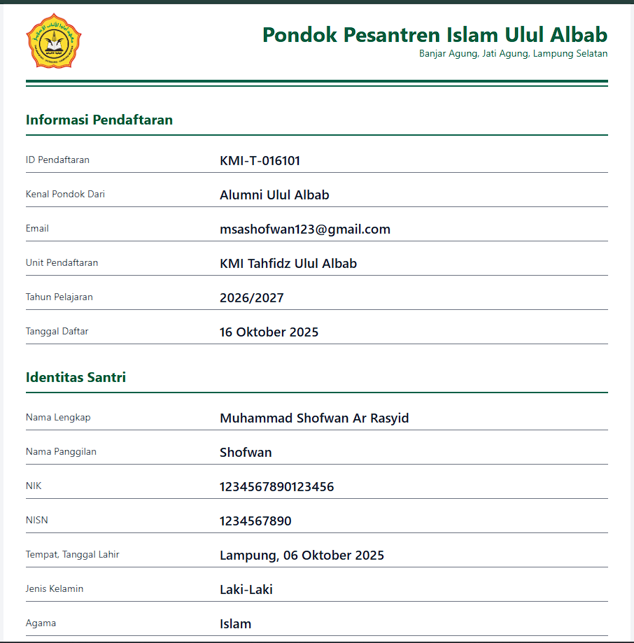 |

---

## WhatsApp Integration

Communication workflow and WhatsApp-based interactions.

| Screenshot                |
| ------------------------- |
| 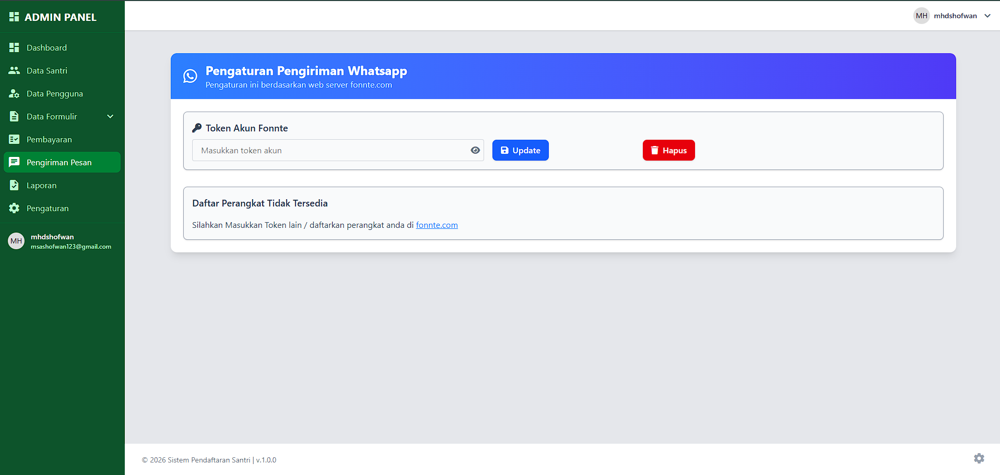 |

---

## Notes

The screenshots presented in this directory are intended solely for demonstration and documentation purposes.

Sensitive information has been omitted or anonymized where appropriate.

The production source code remains private.
